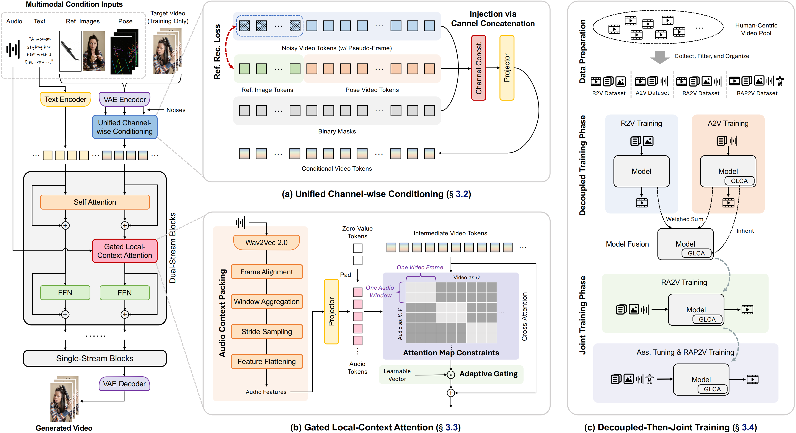
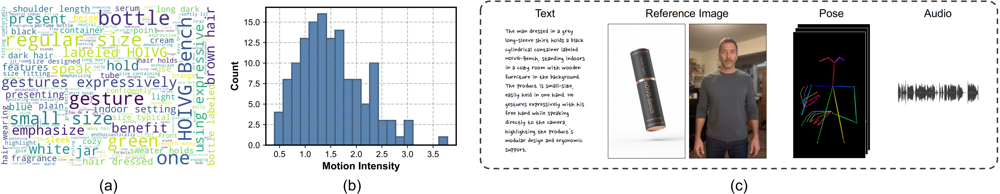

<div align="center">
  
</div>

<h1 align="center" style="line-height: 50px;">
  OmniShow: Unifying Multimodal Conditions for Human-Object Interaction Video Generation
</h1>

<div align="center">
Donghao Zhou<sup>1,*</sup>, Guisheng Liu<sup>2,*</sup>, Hao Yang<sup>2</sup>, Jiatong Li<sup>2,†</sup>, Jingyu Lin<sup>3</sup>, Xiaohu Huang<sup>4</sup>,<br>
Yichen Liu<sup>2</sup>, Xin Gao<sup>2</sup>, Cunjian Chen<sup>3</sup>, Shilei Wen<sup>2,§</sup>, Chi-Wing Fu<sup>1</sup>, Pheng-Ann Heng<sup>1,§</sup>
</div>

<br>

<div align="center">
<sup>1</sup>The Chinese University of Hong Kong, <sup>2</sup>ByteDance, <sup>3</sup>Monash University, <sup>4</sup>The University of Hong Kong
</div>

<br>

<div align="center">
<sup>*</sup>Equal contribution, <sup>†</sup>Project lead, <sup>§</sup>Corresponding author
</div>

<br>

<div align="center">
  <a href="http://correr-zhou.github.io/OmniShow"></a> &ensp;
  <a href="https://arxiv.org/pdf/2604.11804"></a> &ensp;
  <a href="https://github.com/Correr-Zhou/OmniShow"></a> &ensp;
  <a href="https://huggingface.co/datasets/donghao-zhou/HOIVG-Bench">
</div>

---

## 🔥 Updates
- 2026.04: Code is under internal review. Please stay tuned!
- 2026.04: The [technical report of OmniShow](https://arxiv.org/pdf/2604.11804) is released!


## 🌟 Highlights
- **Multimodal Video Generation Model**: OmniShow is an all-in-one model for Human-Object Interaction Video Generation (HOIVG) with text, reference image, audio, and pose conditioning.
- **Flexible Task Coverage**: A single model supports R2V, RA2V, RP2V, and RAP2V generation within one coherent framework.
- **Enabling Broader Applications**: OmniShow exhibits remarkable versatility in broader
applications, such as audio-driven avatars, object swapping, and video remixing.
- **New Benchmark**: HOIVG-Bench provides a dedicated and comprehensive benchmark for evaluating HOIVG under diverse multimodal conditions.

<div align="center">
  
</div>

## 🚀 Introducing OmniShow

We propose **OmniShow**, a video generation model that unifies text, reference image, audio, and pose conditions for HOIVG, which consists of:

1. **Unified Channel-wise Conditioning** effectively injects reference image and pose cues via unified channel concatenation. It augments noisy video tokens with pseudo-frames, which are supervised by a reference reconstruction loss to preserve semantic details.
2. **Gated Local-Context Attention** ensures precise audio-visual synchronization. It packs audio features with sufficient contextual information and injects them via masked attention to align video frames with corresponding audio segments, followed by adaptive gating to stabilize early training.
3. **Decoupled-Then-Joint Training** makes the efficient utilization of heterogeneous datasets possible. We first train specialized R2V and A2V models on separate sub-task datasets, then fuse them via weight interpolation, followed by joint fine-tuning to unify multimodal capabilities.

<div align="center">
  
</div>


## 📊 HOIVG-Bench

To systematically evaluate HOIVG under diverse multimodal conditions, we construct **HOIVG-Bench**, a dedicated benchmark with 135 carefully curated samples and task-specific metrics. Each sample contains a detailed text caption, a human reference image, an object reference image, semantically aligned audio, and a coherent pose sequence.

<div align="center">
  
</div>


## 🎬 Demo

Across varied tasks, OmniShow exhibits high-fidelity reference preservation, natural motion dynamics, and precise audio-visual synchronization. Please visit the [OmniShow project page](https://correr-zhou.github.io/OmniShow/) for more immersive and diverse video demonstrations.

<div align="center">
  
</div>


## 🏆 Benchmark Evaluation

OmniShow achieves overall state-of-the-art performance across various multimodal generation tasks, and it is the only model that supports the full RAP2V setting.

### Reference-to-Video Generation (R2V)

| Method | TA↑ | FaceSim↑ | NexusScore↑ | AES↑ | IQA↑ | VQ↑ | MQ↑ |
| :--- | :---: | :---: | :---: | :---: | :---: | :---: | :---: |
| HunyuanCustom | 7.523 | 0.440 | 0.359 | 0.452 | 0.697 | 10.11 | 5.286 |
| HuMo-1.7B | 7.087 | 0.647 | 0.333 | 0.441 | 0.723 | 9.76 | 3.406 |
| HuMo-17B | 7.949 | 0.843 | 0.346 | 0.448 | 0.726 | 9.97 | 3.685 |
| VACE | <u>8.413</u> | 0.759 | <u>0.368</u> | 0.457 | 0.722 | 10.72 | 5.442 |
| Phantom-1.3B | 8.342 | 0.708 | 0.351 | <u>0.459</u> | 0.722 | 10.90 | <u>5.637</u> |
| Phantom-14B | **8.609** | **0.876** | 0.366 | 0.449 | **0.741** | <u>10.93</u> | 5.517 |
| OmniShow (Ours) | 7.746 | <u>0.874</u> | **0.389** | **0.468** | <u>0.740</u> | **11.12** | **5.885** |

### Reference+Audio-to-Video Generation (RA2V)

| Method | TA↑ | FaceSim↑ | NexusScore↑ | Sync-C↑ | Sync-D↓ | AES↑ | IQA↑ | VQ↑ | MQ↑ |
| :--- | :---: | :---: | :---: | :---: | :---: | :---: | :---: | :---: | :---: |
| HunyuanCustom | 7.289 | 0.457 | <u>0.350</u> | 6.072 | 10.08 | <u>0.439</u> | 0.715 | 9.15 | 3.658 |
| HuMo-1.7B | 7.489 | 0.575 | 0.329 | 7.234 | 9.117 | 0.428 | 0.731 | 9.97 | 4.182 |
| HuMo-17B | **8.146** | <u>0.805</u> | 0.344 | <u>8.013</u> | <u>8.316</u> | 0.439 | <u>0.739</u> | <u>10.27</u> | <u>4.269</u> |
| OmniShow (Ours) | <u>8.093</u> | **0.810** | **0.369** | **8.612** | **7.608** | **0.465** | **0.742** | **10.86** | **5.554** |

### Reference+Pose-to-Video Generation (RP2V)

| Method | TA↑ | FaceSim↑ | NexusScore↑ | AKD↓ | PCK↑ | AES↑ | IQA↑ | VQ↑ | MQ↑ |
| :--- | :---: | :---: | :---: | :---: | :---: | :---: | :---: | :---: | :---: |
| AnchorCrafter | 2.669 | 0.404 | 0.215 | 0.229 | 0.176 | **0.499** | 0.673 | 8.95 | 4.241 |
| VACE | **7.690** | **0.600** | <u>0.352</u> | <u>0.206</u> | <u>0.336</u> | <u>0.450</u> | <u>0.712</u> | <u>10.14</u> | **5.393** |
| OmniShow (Ours) | <u>6.526</u> | <u>0.474</u> | **0.418** | **0.174** | **0.460** | 0.447 | **0.722** | **10.28** | <u>4.937</u> |


## 🔗 Citation
If you find this work useful in your research, please cite:

```bibtex
@article{zhou2026omnishow,
  title={OmniShow: Unifying Multimodal Conditions for Human-Object Interaction Video Generation},
  author={Zhou, Donghao and Liu, Guisheng and Yang, Hao and Li, Jiatong and Lin, Jingyu and Huang, Xiaohu and Liu, Yichen and Gao, Xin and Chen, Cunjian and Wen, Shilei and Fu, Chi-Wing and Heng, Pheng-Ann},
  journal={arXiv preprint arXiv:2604.11804},
  year={2026}
}
```
